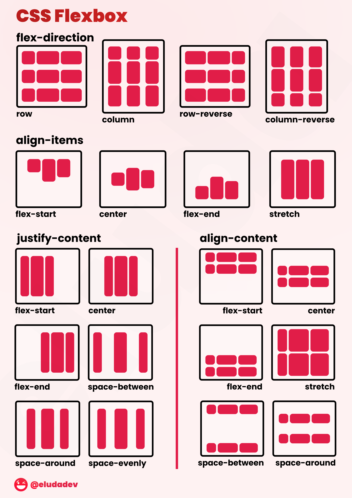
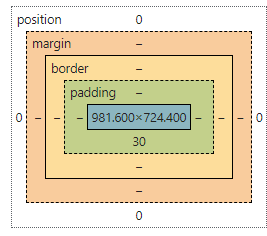

study guide:
- In the following code, what does the link element do?
    + link connects outside resources to the page, like images
- In the following code,  what does a div tag do?
    + div sections off code
- In the following code, what is the difference between the #title and .grid selector?
    + title is the id and grid is the class
- In the following code, what is the difference between padding and margin?
    + padding shrinks item margin pushes stuff away 
- Given this HTML and this CSS how will the images be displayed using flex? #look here
    + 
- What does the following padding CSS do? #look here
    +
- What does the following code using arrow syntax function declaration do? #look here
    + lambda
- What does the following code using map with an array output?
    + it applies the thing to every array item
- What does the following code output using getElementByID and addEventListener?
    + it gets the info stored after a event
- What does the following line of Javascript do using a # selector?
    +' # looks at the tags id
- Which of the following are true? (mark all that are true about the DOM)
    + 
- By default, the HTML span element has a default CSS display property value of: 
    + inline
- How would you use CSS to change all the div elements to have a background color of red?
    + div { background color red }
- How would you display an image with a hyperlink in HTML?
- In the CSS box model, what is the ordering of the box layers starting at the inside and working out?
    
- Given the following HTML, what CSS would you use to set the text "troubl" to green and leave the "double" text unaffected?
    + tag id?
- What will the following code output when executed using a for loop and console.log?
- How would you use JavaScript to select an element with the id of “byu” and change the text color of that element to green?
    + document.getElementbyID.(byu) == green
- What is the opening HTML tag for a paragraph, ordered list, unordered list, second level heading, first level heading, third level heading?
- How do you declare the document type to be html?
- What is valid javascript syntax for if, else, for, while, switch statements?
- What is the correct syntax for creating a javascript object?
- Is is possible to add new properties to javascript objects?
- If you want to include JavaScript on an HTML page, which tag do you use?
- Given the following HTML, what JavaScript could you use to set the text "animal" to "crow" and leave the "fish" text unaffected?
- Which of the following correctly describes JSON?
- What does the console command chmod, pwd, cd, ls, vim, nano, mkdir, mv, rm, man, ssh, ps, wget, sudo  do?
- Which of the following console command creates a remote shell session?
- Which of the following is true when the -la parameter is specified for the ls console command?
- Which of the following is true for the domain name banana.fruit.bozo.click, which is the top level domain, which is a subdomain, which is a root domain?
- Is a web certificate is necessary to use HTTPS.
- Can a DNS A record can point to an IP address or another A record.
- Port 443, 80, 22 is reserved for which protocol? # look up
    + 443 = https 22 = ssh 80 = http
- What will the following code using Promises output when executed?

back up chat notes 
The <link> element in HTML is typically used to link external resources such as stylesheets to a web page. It is commonly used to link to a CSS file that will style the HTML content.

The 
 tag in HTML is a container element that is used to group and structure content on a webpage. It is a block-level element and doesn't have any semantic meaning of its own.

In HTML/CSS, #title is a selector for an HTML element with the id attribute of "title," while .grid is a selector for elements with the class attribute of "grid." The main difference is that #title is for a specific element with a unique ID, while .grid is for multiple elements with the same class.

Padding is the space inside an element between the content and its border, while margin is the space outside the element, separating it from other elements.

You provided no HTML or CSS code to answer this question specifically.

Without the actual CSS code, I can't explain what the "following padding CSS" does.

An arrow function in JavaScript is a concise way to declare a function. It retains the value of this from its enclosing context and does not have its own this. It can be used to define functions in a more compact form.

You didn't provide the code that uses map with an array, so I can't describe its output.

You didn't provide the code that uses getElementById and addEventListener, so I can't explain its output.

Without the actual JavaScript code, I can't describe what a "# selector" would do.

To change the background color of all 
 elements to red, you can use CSS like this:

css
Copy code
div {
    background-color: red;
}
To display an image with a hyperlink in HTML, you can use the following code:
html
Copy code

In the CSS box model, the layers, starting from the inside and working out, are Content, Padding, Border, Margin.

To set the text "troubl" to green and leave "double" text unaffected, you can use CSS like this:

p::first-letter {
    color: green;
}
You didn't provide any specific code for a for loop and console.log, so I can't describe its output.

To select an element with the id of "byu" and change its text color to green using JavaScript, you can use:

javascript
Copy code
document.getElementById("byu").style.color = "green";
Opening HTML tags for:
Paragraph: 

Ordered List: <ol>
Unordered List: <ul>
Second Level Heading (H2): <h2>
First Level Heading (H1): <h1>
Third Level Heading (H3): <h3>
To declare the document type to be HTML, you use the following declaration at the beginning of your HTML document:
html
Copy code
<!DOCTYPE html>
Valid JavaScript syntax for control structures:
if statement
else statement (used with if)
for loop
while loop
switch statement
The correct syntax for creating a JavaScript object is:
javascript
Copy code
var obj = {};
Yes, it is possible to add new properties to JavaScript objects dynamically.

To include JavaScript on an HTML page, you use the 
To set the text "animal" to "crow" and leave the "fish" text unaffected, you can use JavaScript like this:
javascript
Copy code
document.getElementById("yourId").textContent = "crow";
JSON (JavaScript Object Notation) is a lightweight data interchange format that is easy for humans to read and write. It is often used to transmit data between a server and a web application as text.

The console commands:

chmod: Change file permissions.
pwd: Print the current working directory.
cd: Change the current directory.
ls: List directory contents.
vim: Open the Vim text editor.
nano: Open the Nano text editor.
mkdir: Create a new directory.
mv: Move or rename files or directories.
rm: Remove files or directories.
man: Display manual pages.
ssh: Secure Shell for remote access.
ps: List running processes.
wget: Retrieve content from the web.
sudo: Execute a command with superuser privileges.
The console command ssh is used to create a remote shell session.

When the -la parameter is specified for the ls console command, it lists all files and directories, including hidden files, in a long format, providing detailed information.

In the domain name "banana.fruit.bozo.click," "click" is the top-level domain (TLD), "bozo" is a subdomain, and "fruit" is another subdomain. "banana" is not a domain in this context.

Yes, a valid SSL/TLS certificate is necessary to use HTTPS. It helps ensure a secure connection between the server and the client.

Yes, a DNS A record can point to an IP address or another A record. This is often used for load balancing or pointing subdomains to the same IP address.

Port 443 is reserved for HTTPS, Port 80 for HTTP, and Port 22 for SSH.

You didn't provide the code using Promises, so I can't describe its output. If you provide the code, I can help answer this question.