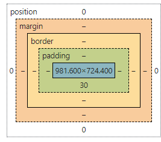

study guide:
- In the following code, what does the link element do?
    + link connects outside resources to the page, like images
- In the following code,  what does a div tag do?
    + div sections off code
- In the following code, what is the difference between the #title and .grid selector?
    + title is the id and grid is the class
- In the following code, what is the difference between padding and margin?
    + padding shrinks item margin pushes stuff away 
- Given this HTML and this CSS how will the images be displayed using flex? #look here
    + 
- What does the following padding CSS do? #look here
    +
- What does the following code using arrow syntax function declaration do? #look here
    + lambda
- What does the following code using map with an array output?
    + it applies the thing to every array item
- What does the following code output using getElementByID and addEventListener?
    + it gets the info stored after a event
- What does the following line of Javascript do using a # selector?
    +' # looks at the tags id
- Which of the following are true? (mark all that are true about the DOM)
    + 
- By default, the HTML span element has a default CSS display property value of: 
    + inline
- How would you use CSS to change all the div elements to have a background color of red?
    + div { background color red }
- How would you display an image with a hyperlink in HTML?
- In the CSS box model, what is the ordering of the box layers starting at the inside and working out?
    
- Given the following HTML, what CSS would you use to set the text "troubl" to green and leave the "double" text unaffected?
    + tag id?
- What will the following code output when executed using a for loop and console.log?
- How would you use JavaScript to select an element with the id of “byu” and change the text color of that element to green?
    + document.getElementbyID.(byu) == green
- What is the opening HTML tag for a paragraph, ordered list, unordered list, second level heading, first level heading, third level heading?
- How do you declare the document type to be html?
- What is valid javascript syntax for if, else, for, while, switch statements?
- What is the correct syntax for creating a javascript object?
- Is is possible to add new properties to javascript objects?
- If you want to include JavaScript on an HTML page, which tag do you use?
- Given the following HTML, what JavaScript could you use to set the text "animal" to "crow" and leave the "fish" text unaffected?
- Which of the following correctly describes JSON?
- What does the console command chmod, pwd, cd, ls, vim, nano, mkdir, mv, rm, man, ssh, ps, wget, sudo  do?
- Which of the following console command creates a remote shell session?
- Which of the following is true when the -la parameter is specified for the ls console command?
- Which of the following is true for the domain name banana.fruit.bozo.click, which is the top level domain, which is a subdomain, which is a root domain?
- Is a web certificate is necessary to use HTTPS.
- Can a DNS A record can point to an IP address or another A record.
- Port 443, 80, 22 is reserved for which protocol? # look up
    + 443 = https 22 = ssh 80 = http
- What will the following code using Promises output when executed?